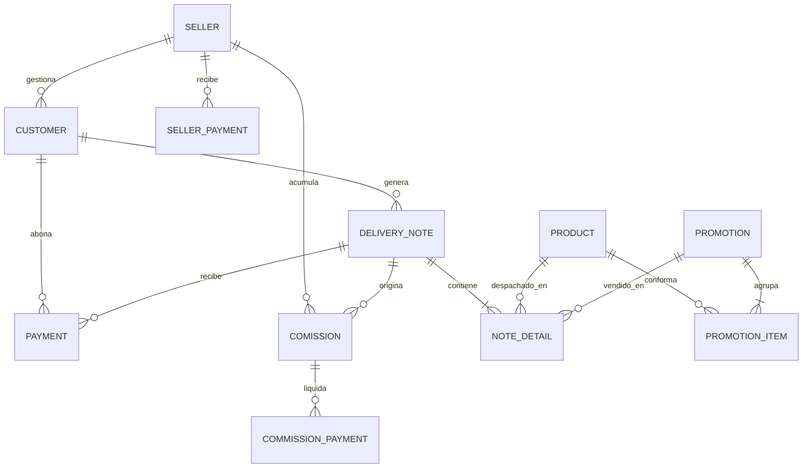

# ⚡ NinOS — Sistema ERP Comercial & de Distribución

<div align="center">

### 🏛️ La Plataforma Definitiva de Gestión Comercial, Distribución, Cartera y Comisiones

*Diseñado, estructurado y forjado con pasión de ingeniería por*
**Luis "Lulujax"**

---

[](https://github.com/lulujax)
[](https://dotnet.microsoft.com/)
[](https://learn.microsoft.com/dotnet/csharp/)
[](https://learn.microsoft.com/visualstudio/xaml-tools/)
[](https://www.postgresql.org/)
[](https://learn.microsoft.com/ef/core/)
[](https://www.questpdf.com/)
[](https://en.wikipedia.org/wiki/Model%E2%80%93view%E2%80%93viewmodel)
[](https://github.com/lulujax/ninos)

**[🌟 El Manifiesto](#-el-manifiesto-de-ninos) • [💎 Módulos](#-módulos-del-sistema) • [🏛️ Arquitectura](#-arquitectura-y-patrones-de-diseño) • [📂 Estructura](#-estructura-del-repositorio) • [🚀 Instalación](#-instalación-y-configuración) • [📊 Modelo de Datos](#-modelo-entidad-relación-erd) • [🔮 Hoja de Ruta](#-hoja-de-ruta) • [👨‍💻 Autor](#-sobre-el-autor)**

</div>

---

## 🌟 El Manifiesto de NinOS

> *"El software de misión crítica no se escribe simplemente para funcionar: se diseña para perdurar, responder con precisión matemática y transformar el caos operativo en una sinfonía de datos claros."*

**NinOS** no es solo un sistema contable o un gestor de ventas más: es una suite ERP de escritorio de nivel empresarial, forjada desde los cimientos para redefinir cómo operan las distribuidoras mayoristas, importadoras y empresas comerciales de alto volumen.

Cada línea de código responde a un propósito: erradicar los cuellos de botella, otorgar visibilidad financiera absoluta al instante y blindar la integridad contable con transacciones atómicas e inmutables.

---

## 💎 Módulos del Sistema

```
                    ┌─────────────────────────────────────────────┐
                    │                NinOS CORE                   │
                    └─────────────────────────────────────────────┘
        ▲            ▲              ▲              ▲             ▲
        │            │              │              │             │
┌───────┴─────┐ ┌───┴──────┐ ┌─────┴─────┐ ┌──────┴─────┐ ┌─────┴──────┐
│   INVENTARIO │ │ DESPACHOS│ │  CARTERA  │ │ TESORERÍA  │ │  FUERZA DE │
│      &       │ │    &     │ │    &      │ │      &     │ │   VENTAS   │
│ PROMOCIONES  │ │FACTURACIÓN│ │ COBRANZAS │ │ AUDITORÍA  │ │ & COMISION │
└──────────────┘ └──────────┘ └───────────┘ └────────────┘ └────────────┘
```

### 1. 📦 Control Maestro de Inventario & Motor de Promociones

- **Catálogo de Alta Precisión:** estructuración estricta de ítems mediante SKU, descripciones, costos directos, márgenes porcentuales dinámicos y precios calculados al mayor y al detal.
- **Motor de Promociones Compuestas (`promotion` / `promotion_item`):** empaqueta múltiples productos en combos comerciales a precios promocionales, con decremento atómico del stock individual en cada venta.
- **Trazabilidad y Mínimos Críticos:** monitoreo reactivo de existencias para anticipar quiebres de inventario.
- **Historial de Movimiento de Stock (`ProductSalesHistoryWindow`):** al hacer doble clic en un producto se abre su kárdex por notas: *ventas* descuentan y *anulaciones* reponen, con color verde (entrada) / rojo (salida) y total vendido.

### 2. 📑 Facturación Rápida, Despachos & Ciclo de Notas

- **Punto de Venta Agilizado (`SalesView`):** búsqueda instantánea de clientes, predictivo de productos/promociones y cálculo en tiempo real de subtotales, descuentos y montos netos.
- **Flujo Operativo de Entrega (`delivery_note` / `note_detail`):** seguimiento granular del ciclo de vida: *Pendiente* ➔ *Pagada* ➔ *Anulada*.
- **Motor PDF Vectorial (`NotePdfGenerator`):** genera notas de entrega editorialmente impecables con desglose fiscal y vista previa modal (`NotePreviewWindow`).

### 3. 💳 Cuentas por Cobrar (CxC) & Blindaje Financiero

- **Control de Cartera en Tiempo Real (`AccountsReceivableView`):** dashboard centralizado que agrupa la deuda por cliente y vendedor (Tabs: Todos / Sandra / Anais / Alejandra).
- **Semáforo Financiero Visual (`BalanceColorConverter`):** marcado cromático reactivo para solventes, en periodo de gracia y en mora.
- **Kárdex Histórico Cruzado:** conciliación transparente de notas emitidas contra pagos aplicados. Edición inline de montos y descuentos por nota con recálculo automático.

### 4. 💰 Tesorería, Abonos & Auditoría Bancaria

- **Recepción de Cobros Multidivisa (`PaymentsView` / `AddPaymentWindow`):** pagos totales o abonos fraccionados, con nota pre-cargada según el origen (fila CxC o historial).
- **Auditoría Transaccional Estricta:** registro de banco, referencia de transferencia, cotización de cambio y marcas temporales (`add_payment_audit_columns.sql`).
- **Historial Transaccional Inmutable (`PaymentHistoryWindow` / `PaymentNoteHistoryWindow`):** registro cronológico no editable de cada entrada de dinero.

### 5. 🤝 Fuerza de Ventas & Liquidación de Comisiones

- **Estructura de Vendedores (`seller` / `comission`):** jerarquía de agentes con prefijos identificadores asignados a carteras.
- **Liquidación Automatizada (`CommissionService`):** comisiones basadas únicamente en notas cobradas o despachadas.
- **Gestión de Egresos (`CommissionsView` / `AddCommissionPaymentWindow` / `CommissionHistoryWindow`):** comisiones acumuladas, anticipos y balance neto por desembolsar.

### 6. 👥 Directorio Integral de Clientes

- **Ficha Maestra (`CustomerView` / `AddCustomerWindow`):** datos fiscales (RIF/NIT), teléfonos, dirección fiscal y efectiva de entrega, límite de crédito y vendedor asignado.
- **Protección de Datos:** no se permite borrar un cliente que tenga notas asociadas — se avisa y solo se permite editar.

### 7. 📑 Reportes de Mes (PDF)

- **Botón "Reporte Mes"** en CxC, Ventas y Pagos (`MonthlyReportPdfGenerator`): genera un **PDF detallado del mes** seleccionado — resumen por documento (fecha, documento, cliente, vendedor, monto, detalle, estado), **totales por vendedor** y **total general**.

---

## 🏛️ Arquitectura y Patrones de Diseño

NinOS se construyó bajo los principios de la **Clean Architecture** y los axiomas **SOLID**, desacoplando la lógica de negocio pura de la infraestructura y de los elementos visuales.

```
        ┌─────────────────────────────┐
        │         NinOS.UI            │   WPF / XAML / MVVM
        │  (Views, ViewModels, PDFs)  │
        └──────────────┬──────────────┘
                       │  Consume (interfaces)
                       ▼
        ┌─────────────────────────────┐
        │    NinOS.Infrastructure     │   EF Core, Npgsql
        │  (Services, Repositories,   │
        │   Data, Migrations)         │
        └──────────────┬──────────────┘
                       │  Define / Depende de
                       ▼
        ┌─────────────────────────────┐
        │        NinOS.Domain         │   Entidades puras
        │  (Entities, Enums, DTOs)    │
        └─────────────┬───────────────┘
                      │
                      ▼
        ┌─────────────────────────────┐
        │        PostgreSQL 16        │
        └─────────────────────────────┘
```

### 🧩 Pilares de Ingeniería Aplicados

- **MVVM Puro:** separación radical entre UI y lógica; zero `code-behind` con lógica espagueti.
- **Repository Pattern (`IGenericRepository<T>`, `DeliveryNoteRepository`):** aisla el motor de persistencia de la capa de servicios.
- **Service Layer (`ICustomerService`, `IDeliveryNoteService`, `IAccountsReceivableService`, `IPaymentService`, `ICommissionService`, `IInventoryService`):** la inteligencia comercial vive en servicios orquestados que validan reglas de negocio antes de tocar la BD.
- **Factory Pattern (`NinOSDbContextFactory`, `DbConnectionFactory`):** ciclo de vida eficiente de contextos, en runtime y para herramientas de migración.
- **XAML Value Converters:** transformación desacoplada de tipos de dominio en representaciones gráficas reactivas (`BalanceColorConverter`, `BooleanToVisibilityConverter`, etc.).
- **Inyección de Dependencias:** contenedor DI en `App.xaml.cs` para desacoplar la creación de servicios y ViewModels.

---

## 📂 Estructura del Repositorio

```text
NinOS/
├── migrations/                              # 🗄️ Parches DDL y scripts SQL complementarios
│   ├── add_bank_and_observations.sql
│   ├── add_payment_and_commission_fields.sql
│   └── add_payment_audit_columns.sql
│
├── src/
│   ├── NinOS.Domain/                        # 🔷 CAPA DE DOMINIO (núcleo puro)
│   │   ├── ViewModels/                      # DTOs para reportes y proyecciones
│   │   │   ├── accounts_receivable_dto.cs
│   │   │   ├── payment_dto.cs
│   │   │   ├── commission_dto.cs
│   │   │   ├── commission_payment_dto.cs
│   │   │   ├── product_sales_history_dto.cs
│   │   │   ├── note_print_dto.cs
│   │   │   └── monthly_report_dto.cs        # DTO genérico para reportes de mes
│   │   ├── comission.cs                     # Entidad de comisión devengada
│   │   ├── commission_payment.cs            # Entidad de egreso/anticipo de comisión
│   │   ├── customer.cs                      # Entidad maestra de clientes
│   │   ├── delivery_note.cs                 # Cabecera de nota de entrega
│   │   ├── note_detail.cs                   # Línea de detalle productos/combos
│   │   ├── payment.cs                       # Entidad transaccional de pagos
│   │   ├── product.cs                       # Entidad maestra de productos
│   │   ├── promotion.cs / promotion_item.cs # Combos y promociones
│   │   ├── seller.cs                        # Entidad maestra de vendedores
│   │   └── NinOS.Domain.csproj
│   │
│   ├── NinOS.Infrastructure/                # 🔶 INFRAESTRUCTURA Y ACCESO A DATOS
│   │   ├── data/                            # DbContext, fábricas, seeding
│   │   ├── Migrations/                      # Migraciones Code-First versionadas
│   │   ├── Repositories/                    # Patrón Repositorio (interfaces + impl)
│   │   ├── Services/                        # Casos de uso (interfaces + impl)
│   │   │   ├── Interfaces/
│   │   │   └── Implementations/
│   │   │       ├── AccountsReceivableService.cs
│   │   │       ├── CommissionService.cs
│   │   │       ├── CustomerService.cs
│   │   │       ├── DeliveryNoteService.cs
│   │   │       ├── InventoryService.cs
│   │   │       └── PaymentService.cs
│   │   └── NinOS.Infrastructure.csproj      # EF Core 10, Npgsql, LINQ
│   │
│   └── NinOS.UI/                            # 🔴 CAPA DE PRESENTACIÓN (WPF / MVVM)
│       ├── Common/
│       │   ├── NotePdfGenerator.cs          # Motor PDF de notas de entrega
│       │   ├── MonthlyReportPdfGenerator.cs # Motor PDF de reportes de mes
│       │   ├── RelayCommand.cs              # Implementación de ICommand
│       │   ├── ViewModelBase.cs             # Base reactiva INotifyPropertyChanged
│       │   └── ViewModels/                  # Lógica de interacción por módulo
│       ├── Converters/                      # Value Converters XAML
│       ├── Views/                           # Vistas, formularios y modales XAML
│       ├── App.xaml(.cs)                    # Configuración de inicio + contenedor DI
│       └── NinOS.UI.csproj                  # WinExe WPF + QuestPDF
│
├── NinOS.slnx                               # Solución .NET (formato moderno XML)
└── README.md
```

### 🛠️ Tecnologías y Herramientas

| Componente | Tecnología | Rol en la Solución |
|---|---|---|
| Lenguaje Core | C# 13 | Tipado estricto, POO, pattern matching |
| Plataforma Runtime | .NET 10 LTS | Motor de ejecución de alto desempeño |
| Framework UI | WPF (XAML) | Renderizado reactivo con enlaces de datos avanzados |
| Base de Datos | PostgreSQL 16 | Persistencia relacional, ACID |
| Mapeador ORM | EF Core 10 + Npgsql | Migraciones Code-First y consultas LINQ |
| Motor de Reportes | QuestPDF | Generación vectorial de notas y reportes de mes |
| Inyección de Dependencias | Microsoft.Extensions.DependencyInjection | Contenedor DI moderno |
| Gestión de Versiones | Git & GitHub | Control de cambios y ramas |

---

## 🚀 Instalación y Configuración

### 📋 Prerrequisitos del Entorno

1. **.NET 10 SDK** instalado globalmente.
2. Instancia local o remota de **PostgreSQL** (v15 o superior).
3. IDE recomendado: **Visual Studio 2022/2026** (carga "Desarrollo de escritorio de .NET") o **VS Code** con **C# Dev Kit**.

### 1️⃣ Clonar el Repositorio

```bash
git clone https://github.com/lulujax/ninos.git
cd ninos
```

### 2️⃣ Configurar la Cadena de Conexión

Ajusta los parámetros de tu servidor PostgreSQL en `src/NinOS.Infrastructure/data/DbConnectionFactory.cs`, o define la variable de entorno `NINOS_DB_CONNECTION`:

```csharp
Host=localhost;Database=ninos_db;Username=postgres;Password=1234
```

### 3️⃣ Restaurar Dependencias y Compilar

```bash
dotnet restore NinOS.slnx
dotnet build NinOS.slnx --configuration Release
```

### 4️⃣ Aplicar Migraciones de Base de Datos

```bash
dotnet ef database update --project src/NinOS.Infrastructure --startup-project src/NinOS.UI
```

> **💡 Nota sobre scripts de auditoría:** si requieres aplicar manualmente los parches SQL de observaciones y auditoría contable:

```bash
psql -U postgres -d ninos_db -f migrations/add_bank_and_observations.sql
psql -U postgres -d ninos_db -f migrations/add_payment_and_commission_fields.sql
psql -U postgres -d ninos_db -f migrations/add_payment_audit_columns.sql
```

### 5️⃣ Ejecutar la Suite NinOS

```bash
dotnet run --project src/NinOS.UI
```

---

## 📊 Modelo Entidad-Relación (ERD)



---

## 🔮 Hoja de Ruta

| Estado | Módulo / Mejora |
|---|---|
| ✅ | Catálogo maestro, control de existencias y promociones compuestas |
| ✅ | Motor de emisión de notas de entrega y generador PDF vectorial |
| ✅ | Panel integral de Cuentas por Cobrar (CxC) con semáforo de morosidad |
| ✅ | Auditoría de pagos, abonos fraccionados y conciliación bancaria |
| ✅ | Algoritmo de liquidación y auditoría de comisiones a vendedores |
| ✅ | Reporte de mes (PDF) para CxC, Ventas y Pagos |
| ✅ | Historial de movimiento de stock por producto con signos y colores |
| 🔄 | Arquitectura multi-sucursal con sincronización en la nube (WebSockets) |
| 📊 | Tablero de control gerencial con métricas de rentabilidad y flujo de caja |
| 🏷️ | Impresoras térmicas de despacho y lectores de códigos de barra 2D |

---

## 👨‍💻 Sobre el Autor

NinOS es el resultado de cientos de horas de diseño, arquitectura, refinamiento de código y pasión por crear software que marque la diferencia.

> **Luis "Lulujax"** — Software Engineer & Creator of NinOS
>
> *"El código limpio no es un lujo estético, es el compromiso ético del ingeniero con la calidad, la velocidad y la excelencia."*

<div align="center">

⭐ Si este proyecto te ha resultado inspirador, **¡déjale una estrella en el repositorio!** ⭐

</div>
