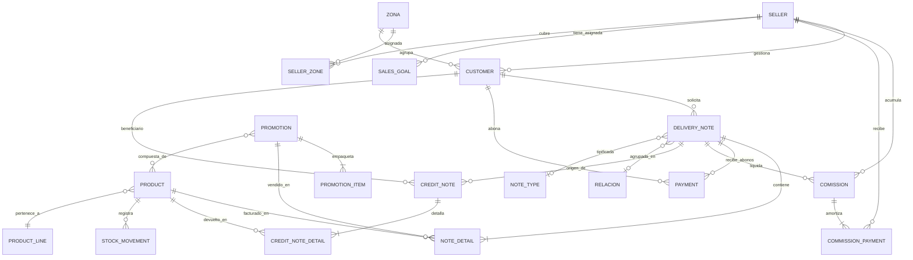

<div align="center">


# ⚡ NinOS ERP — Commercial & Distribution Suite
### *Plataforma de Misión Crítica para Gestión Comercial, Distribución Mayorista, Cartera Reactiva y Liquidación Financiera*

[](https://github.com/lulujax)
[](https://dotnet.microsoft.com/)
[](https://learn.microsoft.com/dotnet/csharp/)
[](https://learn.microsoft.com/visualstudio/xaml-tools/)
[](https://www.postgresql.org/)
[](https://learn.microsoft.com/ef/core/)
[](https://www.questpdf.com/)
[](https://en.wikipedia.org/wiki/Model%E2%80%93view%E2%80%93viewmodel)

<br/>

**[🌟 Filosofía](#-filosofía-y-manifiesto) • [💎 Los módulos](#-los-módulos-del-sistema) • [🖨️ Motor PDF](#-suite-de-reportes-vectoriales-questpdf) • [🏛️ Arquitectura](#-arquitectura-y-patrones-de-diseño) • [📂 Estructura](#-estructura-del-proyecto) • [📊 Modelo de Datos](#-modelo-entidad-relación-erd) • [🚀 Puesta en Marcha](#-instalación-y-puesta-en-marcha) • [📜 Reglas de Negocio](#-reglas-de-negocio-invariantes) • [🔮 Roadmap](#-hoja-de-ruta-y-evolución)**

---

</div>

## 🌟 Filosofía y Manifiesto

> *"El software empresarial de alto rendimiento no se concibe únicamente para digitalizar procesos: se diseña para transformar la incertidumbre operativa en certidumbre matemática, ejecutando transacciones atómicas con cero latencia y elegancia visual."*

**NinOS** es una suite ERP de escritorio de nivel corporativo concebida específicamente para distribuidoras de alimentos, importadoras y empresas de logística comercial con operaciones de alto volumen de rotación.

Frente a sistemas legados lentos y propensos a la dispersión de datos, **NinOS** unifica en una sola consola reactiva todo el ciclo operativo: desde la recepción de pedidos y control granular de stock hasta la emisión de notas, trazabilidad de cobranzas multidivisa, gestión de relaciones semanales (**ProVenta**), procesamiento de devoluciones (**Notas de Crédito**) y liquidación matemática de comisiones para la fuerza de ventas.

---

## 💎 Los módulos del sistema

```
                               ┌───────────────────────────────────────────────────────────┐
                               │                    NinOS CORE ENGINE                      │
                               └───────────────────────────────────────────────────────────┘
                                   │            │             │            │          │
         ┌─────────────────────────┴────┐       │             │            │          └────────────────────────┐
         ▼                              ▼       ▼             ▼            ▼                                   ▼
 ┌───────────────┐ ┌───────────────┐ ┌───────────────┐ ┌──────────────┐ ┌──────────────┐ ┌───────────────┐ ┌───────────────┐
 │   DESPACHOS   │ │   COBRANZAS   │ │     VENTAS    │ │   TESORERÍA  │ │  COMISIONES  │ │   PRO VENTA   │ │ NOTAS CRÉDITO │
 │ (Notas Entrega│ │     (CxC)     │ │   (Punto POS) │ │   (Abonos)   │ │  (Vendedores)│ │  (Semanales)  │ │ (Devoluciones)│
 └───────────────┘ └───────────────┘ └───────────────┘ └──────────────┘ └──────────────┘ └───────────────┘ └───────────────┘
                                   ▲                                                  ▲
                                   │        ┌───────────────────────────────┐        │
                                   └────────┤  MAESTROS TRANSVERSALES     ├────────┘
                                            │ Vendedores · Zonas · Clientes │
                                            │ Líneas de producto · Catálogo │
                                            └───────────────────────────────┘
```

Las pestañas del `MainWindow` están en este orden: **Notas de Entrega · Vendedores · Clientes · Ventas · Cuentas por Cobrar · Pagos · Comisiones · Inventario · Notas de Crédito · Pro Venta**.

### 1. 🚚 Despachos & Notas de Entrega (`DeliveryNotesView`)
*Gestión integral del ciclo de despacho con numeración correlativa inmutable.*
- **Control de Ciclo de Vida:** Estados formales `Pendiente` ➔ `Pagada` ➔ `Devuelta` ➔ `Anulada`.
- **Validación Automática de Stock:** Reserva y decremento en tiempo real al emitir; reincorporación atómica al stock en caso de anulación.
- **Vendedor visible en el encabezado:** El nombre de la vendedora se imprime debajo de *Caracas Venezuela* en la nota, para identificar de quién es la venta.
- **Tipos de nota:** `General` (GEN), `Pro Venta` (MAR/PVP) y `Promoción` (PRM), con banner comercial opcional.
- **Previsualizador Editorial Vectorial:** Modal interactivo (`NotePreviewWindow`) con vista previa, desglose fiscal e impresión.
- **Edición inline** de observaciones de cobranza y fecha de despacho.

### 2. 👩 Fuerza de Ventas (`SellersView`)
*Maestro de vendedoras con zonas asignadas y series de código propias.*
- **Códigos de 3 dígitos** (001 Sandra, 002 Anais, 003 Alejandra, 004 Juan Luis…), usados como prefijo del código de cliente.
- **Zonas asignadas por vendedora** (`seller_zones`): delimitan la cartera y habilitan el agrupamiento Pro Venta por zona.
- **Serie de clientes por vendedora:** el último correlativo usado se persiste para que un código borrado nunca se reutilice.
- **Borrado lógico:** `deleted_at` / `deleted_reason`; nunca se elimina de forma física para no romper el historial.

### 3. 💳 Cuentas por Cobrar (CxC) (`AccountsReceivableView`)
*Monitoreo analítico de la cartera con segmentación reactiva.*
- **Segmentación por vendedora:** Pestañas dedicadas con filtrado instantáneo (*Todos*, *Sandra*, *Anais*, *Alejandra*, *Juan Luis*).
- **Filtro dual:** mes + estado (*Por Cobrar*, *Anuladas*, *Devueltas*, *Todas*).
- **Reporte configurable:** botón **Reporte** que abre un *popup* con mes, **Agrupar en** (Por Vendedor / Por Zona) y checklists de vendedores y zonas. Las listas **son** el filtro: lo que está desmarcado no entra.
- **Regla del reporte:** solo entran notas **Pendientes**. Las pagadas, anuladas y devueltas no salen ni suman.
- **Semáforo Financiero Dinámico:** código de colores reactivo para identificar solventes, en margen o en mora.

### 4. 🛒 Punto de Venta & Emisión Rápida (`SalesView`)
*Terminal de captura veloz diseñada para operaciones de alto tráfico comercial.*
- **Búsqueda Predictiva de Clientes y SKU:** al vuelo por código, descripción, RIF o razón social sin bloqueos de interfaz.
- **Reporte mensual configurable** (mismo *popup* que CxC): mes, agrupado por vendedor/zona, tipo de nota, filtro de cobranza y opción de incluir anuladas y devueltas (que se muestran pero **no** suman).

### 5. 💰 Tesorería, Abonos & Auditoría Bancaria (`PaymentsView`)
*Gestión transaccional estricta de ingresos de efectivo y transferencias.*
- **Pago de monto exacto:** no se permite sobrepagar. Un abono **menor** al saldo sí se acepta y queda saldo pendiente.
- **Sin sobrepago ni descuadre:** se eliminó el margen de tolerancia que llegaba a los $2.
- **Footer de dos totales:** `TOTAL FACTURADO` y `TOTAL COBRADO`. El "total por cobrar" **no** se muestra aquí: es información de cobranza, no de tesorería.
- **Historial No Destructivo** (`PaymentHistoryWindow` / `PaymentNoteHistoryWindow`).

### 6. 🤝 Comisiones (`CommissionsView`)
*Liquidación matemática automatizada de comisiones y control de egresos a vendedoras.*
- **Cálculo sobre recaudo real:** las comisiones se devengan solo sobre lo efectivamente facturado.
- **Selección obligatoria de vendedora:** el `ComboBox` de *Vendedora* arranca vacío; solo después de elegirlo se buscan las notas pendientes, y la lista muestra únicamente las de esa vendedora. Así no se mezclan notas de dos liquidaciones.
- **Kárdex Histórico** (`CommissionHistoryWindow`): devengado vs. pagado por vendedora.

### 7. 👥 Directorio Maestro de Clientes (`CustomerView`)
*Ficha 360° del cliente con blindaje referencial.*
- **Expediente Comercial:** RIF, teléfonos, contacto directo, dirección fiscal y ruta de entrega.
- **Asignación de Zona:** cada cliente pertenece a una zona, que es la que agrupa los reportes.
- **Historial de Cliente** (`CustomerHistoryWindow` / `CustomerHistoryPdfGenerator`): notas de entrega, notas de crédito y pagos.

### 8. 📦 Inventario, Líneas de Producto & Kárdex (`InventoryView`)
*Almacén central, promociones compuestas y seguimiento físico de existencias.*
- **Líneas de producto (`product_line`):** cada marca tiene un **prefijo de código editable** y su propio estándar.
- **Migración de códigos al cambiar el prefijo:** al editar el prefijo se **reescriben todos los productos** de la línea conservando su número (`DEF30508` → `DEFX30508`), y también el historial: *snapshots* de notas de entrega y de notas de crédito, y los documentos de ajuste del kárdex. Todo en una sola transacción, con pantalla de confirmación previa que muestra cuántos registros se van a tocar.
- **Códigos siempre en mayúsculas** y validados contra duplicados: el índice único de `product.product_code` es la red de seguridad final.
- **Promociones Compuestas:** combos que agrupan productos y descuentan el stock de cada componente de forma atómica.
- **Kárdex Reactivo:** doble clic en un producto para ver entradas y salidas con acumulado.
- **Papelera lógica** para productos, promociones, clientes, vendedoras y zonas.

### 9. 📊 Pro Venta & Relaciones Semanales (`ProVentaView`)
*Orquestación de relaciones de entrega semanales.*
- **Arranque en estado vacío:** el módulo **no** preselecciona mes ni carga datos. Hasta que elijas un mes, muestra *"Seleccione un mes para ver el reporte"* y las tablas quedan vacías a propósito.
- **Agrupación Semanal:** desglose del mes en semanas operativas.
- **Anuladas visibles en rojo:** se muestran marcadas pero **no** suman al monto, ni al conteo de notas, ni a la liquidación de la relación.
- **Metas por vendedor** (`sales_goals`), **liquidación de relaciones** y PDF por detalle.

### 10. 📑 Notas de Crédito (`CreditNotesView`)
*Gestión formal de devoluciones y reversiones de saldo.*
- **Fecha propia de NC:** la columna `FECHA NC` y el filtro por mes siguen la fecha de la nota de crédito, no la de la nota de entrega que se está revirtiendo.
- **Columna TIPO NOTA:** hereda el tipo de la nota de entrega original (`General`, `Pro Venta`, `PVP`, `Promoción`). Los obsequios muestran `Obsequio`. Si la nota original no tiene tipo, cae a `General` en vez de quedar en blanco.
- **Precio NETO en las devoluciones:** se devuelve el precio que el cliente realmente pagó, prorrateando el descuento. Si la nota original no tiene tipo, cae a `General` en vez de quedar en blanco.
- **Recorte proporcional:** si la devolución supera lo disponible, el excedente se recorta proporcionalmente sin bloquear el guardado; el servidor es la autoridad final y deja rastro en el log.
- **Las notas pagadas no se pueden devolver:** el buscador de notas de entrega solo ofrece notas con saldo pendiente. Hay validación en el servicio, no solo en la interfaz.
- **Anulación de NC:** disponible para **obsequio** y **devolución**. Revierte exactamente lo que hizo al crearse: la devolución saca el stock que ingresó y devuelve el abono a la nota de entrega; el obsequio devuelve al inventario el stock que salió. La nota no se borra, queda como `Anulada`.
- **Notas anuladas bien distinguidas:** la columna CATEGORIA muestra **"Anulada"** y toda la fila va en rojo y semi negrita.
- **Reporte configurable:** período (general o mensual), categoría y checkbox **"Incluir notas anuladas"** (apagado por defecto).

---

## 🖨️ Suite de Reportes Vectoriales (QuestPDF)

| Generador | Archivo Fuente | Descripción |
|---|---|---|
| **Nota de Entrega** | `NotePdfGenerator.cs` | Comprobante editorial con desglose fiscal, ítems, totales y coordenadas de pago. |
| **Reporte de Mes** | `MonthlyReportPdfGenerator.cs` | Compartido por **Ventas** y **CxC**. Agrupa por vendedor o por zona, con desglose por grupo. |
| **Relación Semanal ProVenta** | `ProVentaPdfGenerator.cs` | Cuadro de distribución semanal, con las notas anuladas en rojo y aparte del total. |
| **Detalle de Relación ProVenta** | `ProVentaDetailPdfGenerator.cs` | Desglose ítem por ítem de cada relación comercial. |
| **Reporte de Pagos** | `PaymentsReportPdfGenerator.cs` | Recaudaciones del mes. Los asientos de anulación van en bloque aparte y **no** suman. |
| **Comprobante de Comisión** | `CommissionPdfGenerator.cs` | Recibo de liquidación y desglose de comisiones acumuladas y pagadas. |
| **Reporte de Notas de Crédito** | `CreditNotesReportPdfGenerator.cs` | Auditoría de devoluciones del período, con y sin anuladas. |
| **Catálogo de Precios** | `PriceListPdfGenerator.cs` | Lista de precios con branding corporativo. |
| **Historial de Cliente** | `CustomerHistoryPdfGenerator.cs` | Consolidado de notas, notas de crédito y pagos por cliente. |

### Regla de totales en todos los PDF
Las notas **anuladas** y las **devueltas** **nunca** suman. Aparecen marcadas en su color (rojo y morado) y en su propio bloque al pie, con la leyenda *"Excluidas del subtotal y total"*. Se aplica igual en subtotales, total general, promedio, comparativo contra el periodo anterior, barras de gráficos y en el cumplimiento de metas. Si un filtro deja un grupo sin ninguna nota vigente, se avisa en vez de imprimir una página con total 0.

---

## 🏛️ Arquitectura y Patrones de Diseño

```
       ┌────────────────────────────────────────────────────────┐
       │                       NinOS.UI                         │
       │       WPF • Modern XAML • MVVM • Reactive Event Mesh   │
       │       Value Converters • Custom Dialogs • QuestPDF     │
       └───────────────────────────┬────────────────────────────┘
                                   │  Consume abstracciones (DI)
                                   ▼
       ┌────────────────────────────────────────────────────────┐
       │                 NinOS.Infrastructure                   │
       │      EF Core 10 • Npgsql • Migrations • Repositories   │
       │      Business Services (Delivery, AR, Payment, etc.)   │
       └───────────────────────────┬────────────────────────────┘
                                   │  Implementa interfaces y referencia
                                   ▼
       ┌────────────────────────────────────────────────────────┐
       │                      NinOS.Domain                      │
       │       Entidades Puras • DTOs de Reporte • Enums        │
       │       Zero Dependencias Externas (POCOs puros)         │
       └───────────────────────────┬────────────────────────────┘
                                   │  Persiste / Consulta
                                   ▼
       ┌────────────────────────────────────────────────────────┐
       │                     PostgreSQL 16                      │
       │       ACID • Índices Únicos • Integridad Referencial   │
       └────────────────────────────────────────────────────────┘
```

### 🧩 Pilares Técnicos Destacados

- **MVVM Radical:** la lógica vive en los ViewModels; las vistas usan `DataBinding`, `RelayCommand` e `ICommand`.
- **Malla de Eventos Reactiva Inter-ViewModel:** `AppDataEvents.CatalogsChanged` + callbacks por ViewModel (`OnNoteSaved`, `OnCreditNoteSaved`) para que un cambio en un módulo refresque inventario, cobranzas, pagos y Pro Venta sin recargar la aplicación.
- **Inyección de Dependencias:** `Microsoft.Extensions.DependencyInjection` configurado en `App.xaml.cs`.
- **Estrategia Híbrida de Conexión:** variable de entorno (`NINOS_DB_CONNECTION`) ➔ `appsettings.json` ➔ servidor por defecto en `DbConnectionFactory.cs`.
- **Reintento de arranque:** si la base no está disponible al iniciar, el diálogo ofrece **Reintentar** hasta 5 veces antes de permitir salir. Los botones llevan texto propio (`Reintentar` / `Salir`) en vez de *Sí* / *No*.
- **Sistema de Diálogos Unificado (`AppDialogWindow` / `AppDialog`):** modales con el diseño de la aplicación, sin recurrir a los diálogos nativos del SO.
- **Reglas de código en dominio:** `product_code_rules` y `stock_movement_writer` concentran el estándar de códigos y la escritura del kárdex, de modo que el formulario, el servicio y la validación hablen del mismo formato.

---

## 📂 Estructura del Proyecto

```text
NinOS/
├── migrations/                                  # 🗄️ Scripts DDL y parches de auditoría SQL
│   ├── add_bank_and_observations.sql
│   ├── add_payment_and_commission_fields.sql
│   ├── add_payment_audit_columns.sql
│   ├── add_unique_product_code.sql
│   ├── normalize_legacy_product_codes.sql
│   ├── normalize_product_category_case.sql
│   └── fix_credit_note_creation_date.sql        # Corrección de fechas históricas de NC
│
├── src/
│   ├── NinOS.Domain/                            # 🔷 CAPA DE DOMINIO (Núcleo Puro)
│   │   ├── ViewModels/                          # DTOs de proyección y reportes
│   │   ├── customer.cs / seller.cs / seller_zone.cs
│   │   ├── zona.cs                              # Zonas (marca de territorio)
│   │   ├── delivery_note.cs / note_detail.cs
│   │   ├── credit_note.cs / credit_note_detail.cs
│   │   ├── payment.cs                           # Pagos (amount_usd admite negativos: NC y asientos)
│   │   ├── commission.cs / commission_payment.cs
│   │   ├── product.cs / product_line.cs         # Producto y línea con prefijo de código
│   │   ├── promotion.cs / relacion.cs / sales_goal.cs
│   │   ├── stock_movement.cs                    # Movimientos de almacén
│   │   ├── product_code_rules.cs                # Estándar PREFIJO + CORRELATIVO
│   │   └── product_code_migration_dto.cs        # Preview y resultado de migración de prefijos
│   │
│   ├── NinOS.Infrastructure/                    # 🔶 CAPA DE INFRAESTRUCTURA
│   │   ├── data/                                # DbContext, ConnectionFactory, Seeding
│   │   ├── Logging/AppLog.cs
│   │   ├── Migrations/                          # Migraciones Code-First versionadas (35)
│   │   └── Services/
│   │       ├── Interfaces/
│   │       ├── Implementations/                 # Servicios de lógica comercial
│   │       └── stock_movement_writer.cs         # Escritor transaccional de kárdex
│   │
│   └── NinOS.UI/                                # 🔴 CAPA DE PRESENTACIÓN (WPF / XAML)
│       ├── Assets/                              # Logo .png (512²) + .ico multi-resolución
│       ├── Common/                              # Generadores PDF, ViewModels base, Comandos
│       │   └── ViewModels/                      # Un ViewModel por módulo + reportes
│       ├── Converters/                          # ValueConverters XAML
│       ├── Views/                               # Vistas, modales y ventanas (35 .xaml)
│       └── App.xaml(.cs)                        # Arranque, reintento y contenedor DI
│
├── AGENTS.md                                    # Reglas de negocio del repositorio
├── NinOS.slnx                                   # Solución moderna .NET XML
└── README.md
```

---

## 📊 Modelo Entidad-Relación (ERD)


```mermaid
erDiagram
    SELLER ||--o{ CUSTOMER : "gestiona"
    SELLER ||--o{ COMISSION : "acumula"
    SELLER ||--o{ COMMISSION_PAYMENT : "recibe"
    SELLER ||--o{ SALES_GOAL : "tiene_asignada"
    SELLER ||--o{ SELLER_ZONE : "cubre"

    ZONA ||--o{ SELLER_ZONE : "asignada"
    ZONA ||--o{ CUSTOMER : "agrupa"

    CUSTOMER ||--o{ DELIVERY_NOTE : "solicita"
    CUSTOMER ||--o{ PAYMENT : "abona"
    CUSTOMER ||--o{ CREDIT_NOTE : "beneficiario"

    DELIVERY_NOTE ||--|{ NOTE_DETAIL : "contiene"
    DELIVERY_NOTE ||--o{ PAYMENT : "recibe_abonos"
    DELIVERY_NOTE ||--o{ COMISSION : "liquida"
    DELIVERY_NOTE ||--o{ CREDIT_NOTE : "origen_de"
    DELIVERY_NOTE }o--o| RELACION : "agrupada_en"
    DELIVERY_NOTE }o--o| NOTE_TYPE : "tipificada"

    PRODUCT ||--o{ NOTE_DETAIL : "facturado_en"
    PRODUCT ||--o{ CREDIT_NOTE_DETAIL : "devuelto_en"
    PRODUCT ||--o{ STOCK_MOVEMENT : "registra"
    PRODUCT }o--|| PRODUCT_LINE : "pertenece_a"

    PROMOTION ||--|{ PROMOTION_ITEM : "empaqueta"
    PROMOTION ||--o{ NOTE_DETAIL : "vendido_en"
    PROMOTION }o--o{ PRODUCT : "compuesta_de"

    CREDIT_NOTE ||--|{ CREDIT_NOTE_DETAIL : "detalla"
    COMISSION ||--|{ COMMISSION_PAYMENT : "amortiza"
```

**Notas de modelado relevantes:**
- `note_detail.product_code_snapshot` y `credit_note_detail.product_code_snapshot` guardan el código del producto **tal como estaba** al emitir el documento. Las notas se muestran con el snapshot, no con el código actual.
- `payment.amount_usd` admite valores **negativos**: una nota de crédito se registra como abono negativo para restar en el saldo, y la anulación genera el asiento positivo que lo revierte.

---

## 🚀 Instalación y Puesta en Marcha

### 📋 Prerrequisitos
1. **.NET 10 SDK** (v10.0.100 o superior).
2. **PostgreSQL** (v15 o v16) local o accesible por red/VPS.
3. **IDE Recomendado:** Visual Studio 2022/2026 (carga *"Desarrollo de escritorio de .NET"*) o VS Code con *C# Dev Kit*.

### 1️⃣ Clonar el Repositorio
```bash
git clone https://github.com/lulujax/ninos.git
cd ninos
```

### 2️⃣ Configurar la Base de Datos
- **Opción A (Variable de Entorno - Recomendada en Producción):**
  ```powershell
  $env:NINOS_DB_CONNECTION="Host=localhost;Port=5432;Database=ninos_db;Username=postgres;Password=tu_password;"
  ```
- **Opción B (`appsettings.json` junto al binario):**
  ```json
  {
    "ConnectionStrings": {
      "NinOSDb": "Host=localhost;Port=5432;Database=ninos_db;Username=postgres;Password=tu_password;"
    }
  }
  ```

### 3️⃣ Restaurar, Compilar y Migrar
```bash
dotnet restore NinOS.slnx
dotnet build NinOS.slnx -c Release
dotnet ef database update --project src/NinOS.Infrastructure --startup-project src/NinOS.UI
```

> [!TIP]
> Parches SQL adicionales aplicables con `psql`:
> ```bash
> psql -U postgres -d ninos_db -f migrations/add_bank_and_observations.sql
> psql -U postgres -d ninos_db -f migrations/add_payment_and_commission_fields.sql
> psql -U postgres -d ninos_db -f migrations/add_payment_audit_columns.sql
> psql -U postgres -d ninos_db -f migrations/normalize_legacy_product_codes.sql
> psql -U postgres -d ninos_db -f migrations/normalize_product_category_case.sql
> ```

### 4️⃣ Ejecutar
```bash
dotnet run --project src/NinOS.UI
```

> [!NOTE]
> Si la base no está disponible, el arranque ofrece **Reintentar** hasta 5 veces en lugar de cerrarse.

---

## 📜 Reglas de Negocio (invariantes)

Estas reglas dan por sentadas varias pantallas. Si cambias una, revisa las demás.

| Regla | Dónde vive |
|---|---|
| Las notas **anuladas** y **devueltas nunca suman** en totales, footers, subtotales, promedios, comparativos, cumplimiento de metas ni gráficos de PDF. Salen a la vista en color y en bloque aparte. | Generadores PDF + ViewModels |
| Una nota de entrega **pagada no admite nota de crédito**: no hay saldo que devolver. | `CreditNoteService` |
| Las devoluciones se calculan al **precio neto** (con descuento prorrateado), con recorte proporcional si exceden lo disponible. | `CreditNoteService` |
| Los **códigos de producto** se guardan en mayúsculas y son únicos; cambiar el prefijo de una línea **reescribe** productos e historial. | `product_code_rules`, `ProductLineService` |
| La **fecha de la NC** es la fecha de emisión del crédito, no la de la nota de entrega. El filtro por mes sigue a la NC. | `CreditNoteService` |
| Las fechas se guardan en **UTC** y se muestran en hora local (`ToLocalTime()`), o se ve el día anterior por la noche. | DTOs de reporte |
| Los **pagos no pueden exceder** el saldo pendiente. Un abono menor sí se acepta. | `AddPaymentWindow` |
| La **zona** es la que agrupa reportes; el **vendedor** es el que liquida. | `AccountsReceivable`, `ProVenta` |
| Los catálogos (`product_line`, `zona`, `seller`, `customer`, `promotion`) se **borran lógicamente**, nunca en cascada física. | Migraciones *SoftDelete* |

---

## 🔮 Hoja de Ruta y Evolución

| Estado | Característica | Descripción |
|:---:|---|---|
| ✅ | **Core de Facturación & Despacho** | Notas de entrega, cálculo preciso, vendedor visible y previsualización. |
| ✅ | **Maestros de Vendedoras y Zonas** | Códigos de 3 dígitos, zonas asignadas y zonas de cliente. |
| ✅ | **Cuentas por Cobrar** | Tabs por vendedora, filtro de mes/estado y reporte configurable. |
| ✅ | **Notas de Crédito** | Fecha propia, tipo de nota, precio neto, anulación y exclusiones. |
| ✅ | **Pro Venta** | Relaciones semanales, arranque en vacío, anuladas visibles sin sumar. |
| ✅ | **Líneas de Producto** | Prefijo editable con migración de códigos e historial. |
| ✅ | **Motor Vectorial QuestPDF** | 9 generadores, con reglas de exclusión de anuladas. |
| ✅ | **Arranque resiliente** | Reintento automático ante base de datos no disponible. |
| 🔄 | **Sincronización Cloud Multisede** | Conexión bidireccional en tiempo real para sucursales remotas. |
| 🔄 | **Impresión Térmica ESC/POS** | Driver nativo para ticketeras de 58mm y 80mm. |
| 💡 | **Dashboard Ejecutivo de BI** | Rotación de SKU, margen operativo y flujo proyectado. |
| 💡 | **App Móvil de Preventa (MAUI)** | Toma de pedidos offline con sincronización en ruta. |

---

## 👨‍💻 Autor y Créditos

**NinOS** ha sido concebido, estructurado y programado con los más altos estándares de ingeniería de software por:

<div align="center">

### **Luis "Lulujax"**
*Software Engineer & Systems Architect*

[](https://github.com/lulujax)

> *"El código elegante no es un capricho estético: es el compromiso innegociable del desarrollador con la robustez, la estabilidad y la productividad de quienes dependen de él a diario."*

---

⭐ **¿Encontraste útil o inspirador este proyecto?** Déjale una estrella en el repositorio. ⭐

</div>