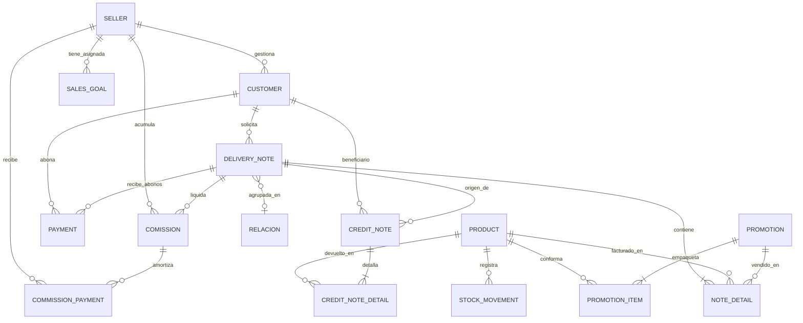

<div align="center">


# ⚡ NinOS ERP — Commercial & Distribution Suite
### *Plataforma de Misión Crítica para Gestión Comercial, Distribución Mayorista, Cartera Reactiva y Liquidación Financiera*

[](https://github.com/lulujax)
[](https://dotnet.microsoft.com/)
[](https://learn.microsoft.com/dotnet/csharp/)
[](https://learn.microsoft.com/visualstudio/xaml-tools/)
[](https://www.postgresql.org/)
[](https://learn.microsoft.com/ef/core/)
[](https://www.questpdf.com/)
[](https://en.wikipedia.org/wiki/Model%E2%80%93view%E2%80%93viewmodel)

<br/>

**[🌟 Filosofía](#-filosofía-y-manifiesto) • [💎 Los 9 Módulos](#-los-9-módulos-del-sistema) • [🖨️ Motor PDF](#️-suite-de-reportes-vectoriales-questpdf) • [🏛️ Arquitectura](#️-arquitectura-y-patrones-de-diseño) • [📂 Estructura](#-estructura-del-proyecto) • [📊 Modelo de Datos](#-modelo-entidad-relación-erd) • [🚀 Puesta en Marcha](#-instalación-y-puesta-en-marcha) • [🔮 Roadmap](#-hoja-de-ruta-y-evolución) • [👨‍💻 Autor](#-autor-y-créditos)**

---

</div>

## 🌟 Filosofía y Manifiesto

> *"El software empresarial de alto rendimiento no se concibe únicamente para digitalizar procesos: se diseña para transformar la incertidumbre operativa en certidumbre matemática, ejecutando transacciones atómicas con cero latencia y elegancia visual."*

**NinOS** es una suite ERP de escritorio de nivel corporativo concebida específicamente para distribuidoras de alimentos, importadoras y empresas de logística comercial con operaciones de alto volumen de rotación. 

Frente a sistemas legados lentos y propensos a la dispersión de datos, **NinOS** unifica en una sola consola reactiva todo el ciclo operativo: desde la recepción de pedidos y control granular de stock hasta la emisión de notas, trazabilidad de cobranzas multidivisa, gestión de relaciones semanales (**ProVenta**), procesamiento de devoluciones (**Notas de Crédito**) y liquidación matemática de comisiones para la fuerza de ventas.

---

## 💎 Los 9 Módulos del Sistema

```
                               ┌───────────────────────────────────────────────────────────┐
                               │                    NinOS CORE ENGINE                      │
                               └───────────────────────────────────────────────────────────┘
                                   │            │             │            │          │
         ┌─────────────────────────┴────┐       │             │            │          └────────────────────────┐
         ▼                              ▼       ▼             ▼            ▼                                   ▼
 ┌───────────────┐ ┌───────────────┐ ┌───────────────┐ ┌──────────────┐ ┌──────────────┐ ┌───────────────┐ ┌───────────────┐
 │   DESPACHOS   │ │   COBRANZAS   │ │     VENTAS    │ │   TESORERÍA  │ │  COMISIONES  │ │   PRO VENTA   │ │ NOTAS CRÉDITO │
 │ (Notas Entrega│ │     (CxC)     │ │   (Punto POS) │ │   (Abonos)   │ │  (Vendedores)│ │  (Semanales)  │ │ (Devoluciones)│
 └───────────────┘ └───────────────┘ └───────────────┘ └──────────────┘ └──────────────┘ └───────────────┘ └───────────────┘
                                   ▲                                                  ▲
                                   │           ┌──────────────────────────┐           │
                                   └───────────┤   INVENTARIO & CLIENTES  ├───────────┘
                                               │ (Kárdex, Combos, Precios)│
                                               └──────────────────────────┘
```

### 1. 🚚 Despachos & Notas de Entrega (`DeliveryNotesView`)
*Gestión integral del ciclo de despacho de pedidos con numeración correlativa inmutable.*
- **Control de Ciclo de Vida:** Estados formales `Pendiente` ➔ `Pagada` ➔ `Anulada`.
- **Validación Automática de Stock:** Reserva y decremento en tiempo real al emitir; reincorporación atómica al stock en caso de anulación.
- **Previsualizador Editorial Vectorial:** Modal interactivo (`NotePreviewWindow`) con opciones de exportación inmediata, desglose fiscal e impresión.
- **Banners Promocionales y Cuentas Bancarias:** Renderizado condicional en nota de entrega de coordenadas de pago y banners comerciales por temporada.

### 2. 💳 Cuentas por Cobrar (CxC) & Semáforo de Morosidad (`AccountsReceivableView`)
*Monitoreo analítico de la cartera de clientes con segmentación reactiva.*
- **Segmentación por Vendedor:** Pestañas dedicadas con filtrado instantáneo (*Todos*, *Sandra*, *Anais*, *Alejandra*, etc.).
- **Semáforo Financiero Dinámico (`BalanceColorConverter`):** Código de colores reactivo para identificar al instante clientes solventes, en margen de gracia o en estado de mora severa.
- **Filtro Mensual Inteligente:** Selección de mes y año con carga optimizada y totales de saldo vivo en tiempo real.
- **Edición Inline y Conciliación:** Modificación auditada de importes y descuentos por nota con recálculo automático de saldos globales.

### 3. 🛒 Punto de Venta & Emisión Rápida (`SalesView`)
*Terminal de captura veloz diseñada para operaciones de alto tráfico comercial.*
- **Búsqueda Predictiva de Clientes y SKU:** Búsqueda al vuelo por código, descripción, RIF o razón social sin bloqueos de interfaz.
- **Cálculo Reactivo de Precios:** Aplicación instantánea de tarifas al mayor, detal y promociones compuestas.
- **Subtotales, Descuentos e Impuestos:** Motor de cálculo en memoria que previene desajustes de centavos o redondeos imprecisos.

### 4. 💰 Tesorería, Abonos & Auditoría Bancaria (`PaymentsView`)
*Gestión transaccional estricta de ingresos de efectivo y transferencias.*
- **Abonos Parciales y Totales:** Aplicación de cobros fraccionados a una o múltiples notas pendientes con pre-carga contextual desde CxC.
- **Auditoría de Pagos:** Captura obligatoria de banco emisor, referencia bancaria, fecha y observaciones (`add_payment_audit_columns.sql`).
- **Historial No Destructivo (`PaymentHistoryWindow` / `PaymentNoteHistoryWindow`):** Registro inmutable de cada transacción monetaria para conciliación bancaria libre de discrepancias.

### 5. 🤝 Fuerza de Ventas & Comisiones (`CommissionsView`)
*Liquidación matemática automatizada de comisiones y control de egresos a vendedores.*
- **Cálculo Sobre Recaudo Real:** Las comisiones se devengan únicamente sobre facturación efectivamente cobrada o despachada bajo directrices de la empresa.
- **Gestión de Desembolsos (`AddCommissionPaymentWindow` / `EditCommissionPaymentWindow`):** Registro de anticipos, vales y balance neto pendiente por pagar.
- **Kárdex Histórico de Comisiones (`CommissionHistoryWindow`):** Trazabilidad completa de comisiones devengadas vs. pagos efectuados por vendedor.

### 6. 👥 Directorio Maestro de Clientes (`CustomerView`)
*Ficha 360° del cliente con blindaje referencial de datos.*
- **Expediente Comercial:** Registro de RIF/NIT, teléfonos, contacto directo, dirección fiscal y ruta efectiva de entrega.
- **Asignación de Cartera:** Vinculación directa con el vendedor responsable y límite crediticio.
- **Blindaje Antiborrado:** Protección de integridad que impide eliminar clientes con notas de entrega asociadas, orientando la acción hacia actualización o desactivación.

### 7. 📦 Inventario Estratégico, Combos & Kárdex (`InventoryView`)
*Almacén central, márgenes porcentuales dinámicos y seguimiento físico de existencias.*
- **Motor de Promociones Compuestas (`promotions` / `promotion_items`):** Creación de combos y promociones que agrupan múltiples productos a precio especial, descontando de forma atómica el stock de cada componente.
- **Kárdex Reactivo (`ProductSalesHistoryWindow`):** Doble clic en cualquier producto para inspeccionar su trazabilidad de salidas (ventas) y entradas (anulaciones/notas de crédito) con señalización visual (verde/rojo) y acumulado comercial.
- **Auditoría de Stock (`stock_movements` / `stock_movement_writer`):** Registro histórico con marca de tiempo, tipo de movimiento y documento asociado.

### 8. 📊 Pro Venta & Relaciones Semanales (`ProVentaView`)
*Orquestación de relaciones de entrega semanales para logística de distribución y liquidación.*
- **Agrupación Semanal Automatizada:** Desglose del mes en semanas operativas para seguimiento estructurado de pedidos y rutas de distribución.
- **Seguimiento de Relaciones:** Panel dividido entre relaciones de entrega *Pendientes* y *Pagadas/Liquidadas*.
- **Metas Comerciales (`sales_goals`):** Definición y monitoreo del cumplimiento de metas por vendedor y periodo.
- **Liquidación de Relaciones (`ProVentaPaymentWindow` / `ProVentaHistoryWindow`):** Cierre y liquidación financiera de relaciones con emisión de comprobante.

### 9. 📑 Notas de Crédito & Ajustes de Cartera (`CreditNotesView`)
*Gestión formal de devoluciones, ajustes de facturación y reversiones de saldo.*
- **Ajuste Automatizado de Cartera:** Al registrar una nota de crédito, el saldo pendiente de la nota de entrega origen se ajusta de inmediato.
- **Reincorporación Opcional de Mercancía:** Capacidad de reingresar automáticamente las unidades devueltas al stock disponible con registro en el kárdex.
- **Expediente Vectorial:** Ventana de detalle (`CreditNoteDetailWindow`) y generación de comprobante PDF de devolución.

---

## 🖨️ Suite de Reportes Vectoriales (QuestPDF)

NinOS incorpora un motor nativo de generación de documentos en formato **PDF vectorial** de calidad de imprenta utilizando **QuestPDF**, sin depender de herramientas externas como Word o navegadores headless:

| Generador | Archivo Fuente | Descripción |
|---|---|---|
| **Nota de Entrega** | `NotePdfGenerator.cs` | Comprobante editorial con desglose fiscal, datos de cliente, ítems, totales y coordenadas de pago. |
| **Reporte de Mes** | `MonthlyReportPdfGenerator.cs` | Análisis mensual completo con listado por documento, totales por vendedor y consolidado general. |
| **Relación Semanal ProVenta** | `ProVentaPdfGenerator.cs` | Cuadro de distribución semanal agrupando notas, clientes, vendedores y montos por liquidar. |
| **Detalle de Relación ProVenta** | `ProVentaDetailPdfGenerator.cs` | Desglose pormenorizado ítem por ítem de cada relación comercial despachada. |
| **Reporte de Pagos & Tesorería** | `PaymentsReportPdfGenerator.cs` | Informe consolidado de recaudaciones bancarias, abonos y transacciones por período. |
| **Comprobante de Comisión** | `CommissionPdfGenerator.cs` | Recibo formal de liquidación y desglose de comisiones acumuladas y pagadas a cada agente. |
| **Reporte de Notas de Crédito** | `CreditNotesReportPdfGenerator.cs` | Auditoría de devoluciones y deducciones aplicadas a la facturación del período. |
| **Catálogo de Precios** | `PriceListPdfGenerator.cs` | Lista de precios mayorista y minorista con branding corporativo para clientes y agentes. |

---

## 🏛️ Arquitectura y Patrones de Diseño

El sistema está cimentado bajo los principios de **Clean Architecture** y las directrices **SOLID**, garantizando un bajo acoplamiento, alta cohesión y testeabilidad total.

```
       ┌────────────────────────────────────────────────────────┐
       │                       NinOS.UI                         │
       │       WPF • Modern XAML • MVVM • Reactive Event Mesh   │
       │       Value Converters • Custom Dialogs • QuestPDF     │
       └───────────────────────────┬────────────────────────────┘
                                   │  Consume abstracciones (DI)
                                   ▼
       ┌────────────────────────────────────────────────────────┐
       │                 NinOS.Infrastructure                   │
       │      EF Core 10 • Npgsql • Migrations • Repositories   │
       │      Business Services (Delivery, AR, Payment, etc.)   │
       └───────────────────────────┬────────────────────────────┘
                                   │  Implementa interfaces y referencia
                                   ▼
       ┌────────────────────────────────────────────────────────┐
       │                      NinOS.Domain                      │
       │       Entidades Puras • DTOs de Reporte • Enums        │
       │       Zero Dependencias Externas (POCOs puros)         │
       └───────────────────────────┬────────────────────────────┘
                                   │  Persiste / Consulta
                                   ▼
       ┌────────────────────────────────────────────────────────┐
       │                     PostgreSQL 16                      │
       │       ACID • Índices Únicos • Integridad Referencial   │
       └────────────────────────────────────────────────────────┘
```

### 🧩 Pilares Técnicos Destacados
- **MVVM Radical:** Cero lógica en el `code-behind`. Las vistas interactúan mediante `DataBinding`, `RelayCommand` y `ICommand`.
- **Malla de Eventos Reactiva Inter-ViewModel:** `MainWindowViewModel` centraliza y orquesta eventos en tiempo real:
  ```csharp
  delivery_notes_vm.OnNoteSaved += () => {
      accounts_receivable_vm?.refresh_data();
      inventory_vm?.refresh_data();
      pro_venta_vm?.refresh_data();
  };
  credit_notes_vm.OnCreditNoteSaved += () => {
      accounts_receivable_vm?.refresh_data();
      payments_vm?.refresh_data();
      inventory_vm?.refresh_data();
      pro_venta_vm?.refresh_data();
  };
  ```
- **Inversión de Dependencias (IoC):** Contenedor oficial `Microsoft.Extensions.DependencyInjection` configurado en `App.xaml.cs`.
- **Estrategia Híbrida de Conexión:** Resolución en 3 fases: Variable de entorno (`NINOS_DB_CONNECTION`) ➔ `appsettings.json` ➔ Servidor VPS configurado de fábrica en `DbConnectionFactory.cs`.
- **Sistema de Diálogos Unificado (`AppDialogWindow` / `AppDialog`):** Ventanas modales elegantes para confirmaciones, advertencias e información sin recurrir a las primitivas estándar del SO.

---

## 📂 Estructura del Proyecto

```text
NinOS/
├── migrations/                                  # 🗄️ Scripts DDL y parches de auditoría SQL
│   ├── add_bank_and_observations.sql
│   ├── add_payment_and_commission_fields.sql
│   └── add_payment_audit_columns.sql
│
├── src/
│   ├── NinOS.Domain/                            # 🔷 CAPA DE DOMINIO (Núcleo Puro)
│   │   ├── ViewModels/                          # DTOs de proyección y reportes
│   │   │   ├── accounts_receivable_dto.cs
│   │   │   ├── commission_dto.cs / commission_payment_dto.cs / commission_receipt_dto.cs
│   │   │   ├── credit_note_dto.cs / credit_note_report_dto.cs
│   │   │   ├── monthly_report_dto.cs / note_print_dto.cs
│   │   │   ├── payment_dto.cs / product_sales_history_dto.cs
│   │   │   └── pro_venta_dto.cs
│   │   ├── customer.cs / seller.cs              # Clientes y agentes de ventas
│   │   ├── delivery_note.cs / note_detail.cs    # Notas de entrega y detalles
│   │   ├── credit_note.cs / credit_note_detail.cs # Notas de crédito y devoluciones
│   │   ├── payment.cs                           # Pagos y recaudos bancarios
│   │   ├── comission.cs / commission_payment.cs # Comisiones y liquidaciones
│   │   ├── product.cs / promotion.cs            # Catálogo y combos
│   │   ├── relacion.cs / sales_goal.cs          # Relaciones ProVenta y metas
│   │   └── stock_movement.cs                    # Movimientos de almacén
│   │
│   ├── NinOS.Infrastructure/                    # 🔶 CAPA DE INFRAESTRUCTURA
│   │   ├── data/                                # DbContext, ConnectionFactory, Seeding
│   │   │   ├── DbConnectionFactory.cs
│   │   │   ├── DbInitializer.cs
│   │   │   ├── NinOSDbContext.cs
│   │   │   └── NinOSDbContextFactory.cs
│   │   ├── Migrations/                          # Migraciones Code-First versionadas
│   │   ├── Repositories/                        # Patrón Repositorio Genérico y Específico
│   │   └── Services/                            # Casos de Uso y Servicios de Negocio
│   │       ├── Interfaces/                      # Contratos desacoplados
│   │       ├── Implementations/                 # Implementaciones de lógica comercial
│   │       └── stock_movement_writer.cs         # Escritor transaccional de kárdex
│   │
│   └── NinOS.UI/                                # 🔴 CAPA DE PRESENTACIÓN (WPF / XAML)
│       ├── Assets/                              # Recursos gráficos, íconos y branding
│       ├── Common/                              # Generadores PDF, ViewModels base, Comandos
│       │   ├── CommissionPdfGenerator.cs
│       │   ├── CreditNotesReportPdfGenerator.cs
│       │   ├── MonthlyReportPdfGenerator.cs
│       │   ├── NotePdfGenerator.cs
│       │   ├── PaymentsReportPdfGenerator.cs
│       │   ├── PriceListPdfGenerator.cs
│       │   ├── ProVentaDetailPdfGenerator.cs
│       │   └── ProVentaPdfGenerator.cs
│       ├── Converters/                          # ValueConverters XAML (Colores, visibilidad)
│       ├── Views/                               # Ventanas y vistas modales del sistema
│       └── App.xaml(.cs)                        # Arranque y contenedor DI
│
├── NinOS.slnx                                   # Archivo de solución moderna .NET XML
└── README.md                                    # Documentación maestra del sistema
```

---

## 📊 Modelo Entidad-Relación (ERD)


```mermaid
erDiagram
    SELLER ||--o{ CUSTOMER : "gestiona"
    SELLER ||--o{ COMISSION : "acumula"
    SELLER ||--o{ COMMISSION_PAYMENT : "recibe"
    SELLER ||--o{ SALES_GOAL : "tiene_asignada"

    CUSTOMER ||--o{ DELIVERY_NOTE : "solicita"
    CUSTOMER ||--o{ PAYMENT : "abona"
    CUSTOMER ||--o{ CREDIT_NOTE : "beneficiario"

    DELIVERY_NOTE ||--|{ NOTE_DETAIL : "contiene"
    DELIVERY_NOTE ||--o{ PAYMENT : "recibe_abonos"
    DELIVERY_NOTE ||--o{ COMISSION : "liquida"
    DELIVERY_NOTE ||--o{ CREDIT_NOTE : "origen_de"
    DELIVERY_NOTE }o--o| RELACION : "agrupada_en"

    PRODUCT ||--o{ NOTE_DETAIL : "facturado_en"
    PRODUCT ||--o{ PROMOTION_ITEM : "conforma"
    PRODUCT ||--o{ CREDIT_NOTE_DETAIL : "devuelto_en"
    PRODUCT ||--o{ STOCK_MOVEMENT : "registra"

    PROMOTION ||--|{ PROMOTION_ITEM : "empaqueta"
    PROMOTION ||--o{ NOTE_DETAIL : "vendido_en"

    CREDIT_NOTE ||--|{ CREDIT_NOTE_DETAIL : "detalla"
    COMISSION ||--o{ COMMISSION_PAYMENT : "amortiza"
```

---

## 🚀 Instalación y Puesta en Marcha

### 📋 Prerrequisitos del Sistema
1. **.NET 10 SDK** (v10.0.100 o superior).
2. **PostgreSQL** (v15 o v16) local o accesible por red/VPS.
3. **IDE Recomendado:** Visual Studio 2022/2026 (con carga *"Desarrollo de escritorio de .NET"*) o Visual Studio Code con *C# Dev Kit*.

---

### 1️⃣ Clonar el Repositorio
```bash
git clone https://github.com/lulujax/ninos.git
cd ninos
```

### 2️⃣ Configurar la Base de Datos
Tienes tres alternativas para definir la cadena de conexión (en orden de prioridad):

- **Opción A (Variable de Entorno - Recomendada en Producción):**
  ```powershell
  # PowerShell
  $env:NINOS_DB_CONNECTION="Host=localhost;Port=5432;Database=ninos_db;Username=postgres;Password=tu_password;"
  ```
- **Opción B (`appsettings.json` junto al binario):**
  ```json
  {
    "ConnectionStrings": {
      "NinOSDb": "Host=localhost;Port=5432;Database=ninos_db;Username=postgres;Password=tu_password;"
    }
  }
  ```
- **Opción C:** Servidor VPS configurado de fábrica en `DbConnectionFactory.cs`.

### 3️⃣ Restaurar Dependencias y Compilar
```bash
dotnet restore NinOS.slnx
dotnet build NinOS.slnx -c Release
```

### 4️⃣ Aplicar Migraciones
```bash
dotnet ef database update --project src/NinOS.Infrastructure --startup-project src/NinOS.UI
```

> [!TIP]
> Si deseas aplicar manualmente los parches SQL adicionales para campos bancarios y auditoría:
> ```bash
> psql -U postgres -d ninos_db -f migrations/add_bank_and_observations.sql
> psql -U postgres -d ninos_db -f migrations/add_payment_and_commission_fields.sql
> psql -U postgres -d ninos_db -f migrations/add_payment_audit_columns.sql
> ```

### 5️⃣ Ejecutar la Aplicación
```bash
dotnet run --project src/NinOS.UI
```

---

## 🔮 Hoja de Ruta y Evolución

| Estado | Característica / Módulo | Descripción |
|:---:|---|---|
| ✅ | **Core de Facturación & Despacho** | Notas de entrega, cálculo numérico preciso y previsualización. |
| ✅ | **Cuentas por Cobrar (CxC)** | Tabs por vendedora, semáforo de morosidad y conciliación. |
| ✅ | **Motor Vectorial QuestPDF** | 8 generadores de documentos de alta fidelidad. |
| ✅ | **Módulo Pro Venta** | Relaciones de notas semanales, estado de liquidación y seguimiento. |
| ✅ | **Notas de Crédito & Devoluciones** | Reintegro automático a inventario y ajuste de saldos de cliente. |
| ✅ | **Trazabilidad Kárdex en Vivo** | Historial visual de entradas/salidas por producto (`stock_movements`). |
| 🔄 | **Sincronización Cloud Multisede** | Conexión bidireccional en tiempo real con WebSockets para sucursales remotas. |
| 🔄 | **Impresión Térmica ESC/POS** | Driver nativo para ticketeras térmicas de 58mm y 80mm en almacén. |
| 💡 | **Dashboard Ejecutivo de Business Intelligence** | Métricas en tiempo real de rotación de SKU, margen operativo y flujo proyectado. |
| 💡 | **App Móvil de Preventa (MAUI)** | Toma de pedidos offline con sincronización automática en ruta. |

---

## 👨‍💻 Autor y Créditos

**NinOS** ha sido concebido, estructurado y programado con los más altos estándares de ingeniería de software por:

<div align="center">

### **Luis "Lulujax"**
*Software Engineer & Systems Architect*

[](https://github.com/lulujax)

> *"El código elegante no es un capricho estético: es el compromiso innegociable del desarrollador con la robustez, la estabilidad y la productividad de quienes dependen de él a diario."*

---

⭐ **¿Encontraste útil o inspirador este proyecto?** Déjale una estrella en el repositorio. ⭐

</div>
